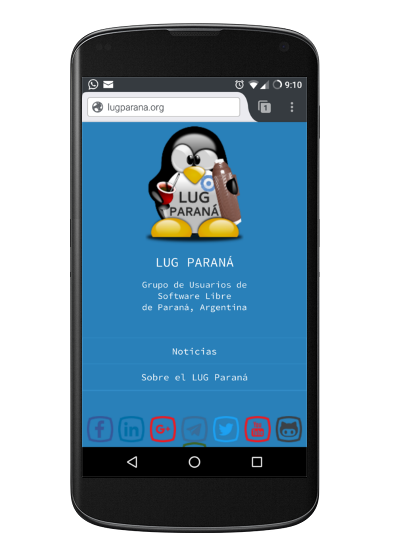
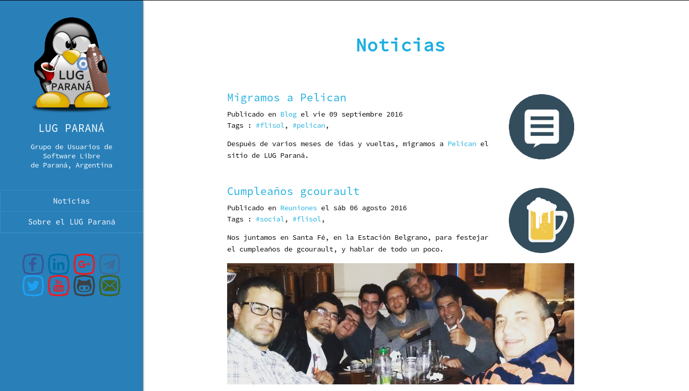

# LugParana Pelican Theme

Responsive theme for [Pelican](http://blog.getpelican.com/) Static Site Generator, Powered by [Python](https://www.python.org/).  
Based on [pelican-blue theme](https://github.com/Parbhat/pelican-blue).

## Demo

You can see the theme in action at https://lugparana.org

### Screenshots






## Features

* Responsive
* Syntax highlighting for code blocks
* Google Analytics
* RSS/ATOM feeds
* Easy to install
* Custom site logo
* Custom Categories logo

## Installation

You can install lugparana theme to your earlier Pelican project or create a new project from the Pelican [Quickstart](http://docs.getpelican.com/en/3.6.3/quickstart.html) guide.

* Clone the repository

```
$ git clone https://github.com/chinosoliard/lugparana-pelican-theme.git
```

* Create a `THEME` variable in your `pelicanconf.py` file and set its value to the location of lugparana theme.

```python
THEME = 'path-to-pelican-blue-theme'
```

If you have placed the `lugparana` theme inside your project's pelican-themes folder, change the `THEME` variable in `pelicanconf.py` to

```python
THEME = 'lugparana'
```

* Add the following code to your `pelicanconf.py` file to display the social icons.

```python
SOCIAL = (('facebook', 'https://www.facebook.com/YourProfile/'),
          ('linkedin', 'https://www.linkedin.com/YourProfile'),
          ('googleplus','https://plus.google.com/YourProfile'),
          ('telegram','https://telegram.me/Link'),
          ('twitter','https://twitter.com/YourProfile'),
          ('youtube','http://www.youtube.com/channel/YourChannel'),
          ('github','http://www.github.com/YourProfile'),
          ('mail','YourMail@YourDomain'),)  
```

* Also, you can add a sitelogo/profile photo, adding the following code to your `pelicanconf.py` file:  

```python
SITELOGO = '/path/to/logo.png'  
```

* There's a way to show custom icons to categories (**WARNING:** Doing this, ALL categories must have an icon):  

  * Save the icons (in png format) with the same name that the category  (category "Events" must be "Events.png") in a folder included in STATIC_PATH in pelicanconf.py.  
  * Add the following to the `pelicanconf.py` file:
```python
CATEGORY_ICONS = True
CATEGORY_ICONS_PATH = "/path/to/category/icons/"
```

* That's it! You have installed `lugparana`. To see the Theme in action run the devserver

```
make devserver
```

**Note:** If you are new to Pelican Static Site Generator, you can read the Pelican [Docs](http://docs.getpelican.com/en/3.6.3/) to learn the working of Pelican. You can also customize the theme after reading the documentation.

## Settings

### pelicanconf.py

LUGParana Pelican theme use the following settings. You can add the following to your `pelicanconf.py` to get the site shown in the screenshots.

```python
SITELOGO = '/images/logo.png'

SITEDESCRIPTION = 'Grupo de Usuarios de </br>Software Libre </br>de Paraná, Argentina'

FAVICON = 'url-to-favicon'

DISPLAY_HOME_ON_MENU = True

DISPLAY_PAGES_ON_MENU = True

MENUITEMS = (('Blog', SITEURL),)

SOCIAL = (('facebook', 'https://www.facebook.com/groups/lugparana/'),
          ('linkedin', 'https://www.linkedin.com/groups/8195477'),
          ('googleplus','https://plus.google.com/communities/102117268282574409059'),
          ('telegram','https://telegram.me/LUGParana'),
          ('twitter','https://twitter.com/lugparana'),
          ('youtube','http://www.youtube.com/channel/UCtzu8DvzTCHlEHse32Pl9hQ'),
          ('github','http://www.github.com/LugParana'),
          ('mail','mailto:lugparana@listas.usla.org.ar'),)i


```

There's a way to show custom icons to categories (**WARNING:** Doing this, ALL categories must have an icon):

  * Save the icons (in png format) with the same name that the category  (category "Events" must be "Events.png") in a folder included in STATIC_PATH in pelicanconf.py.
  * Add the following to the `pelicanconf.py` file:

```python
CATEGORY_ICONS = True
CATEGORY_ICONS_PATH = "/path/to/category/icons/"
```


When developing locally, set the following variable:
```
SITEURL = 'http://localhost:8000'
```

### publishconf.py

When you are ready to publish your site add the following settings to `publishconf.py` file

```python
SITEURL = 'http://your-domain-address'

FEED_ALL_ATOM = 'feeds/all.atom.xml'
CATEGORY_FEED_ATOM = 'feeds/%s.atom.xml'

MENUITEMS = (('Blog', SITEURL),)

DISQUS_SITENAME = ""
GOOGLE_ANALYTICS = ""
```

For more information on publishing your site, read the publishing [docs](http://docs.getpelican.com/en/3.6.3/publish.html)
